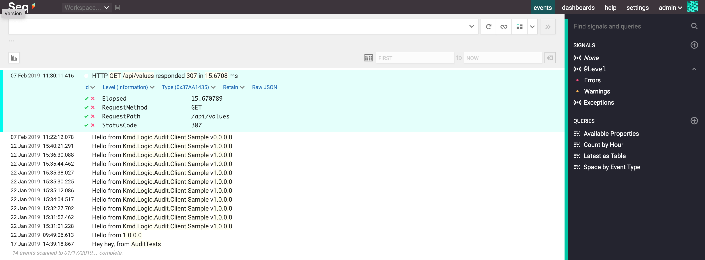

# KMD Logic Audit Client

A dotnet client library for the [KMD Logic](https://console.kmdlogic.io/) Audit Service, which allows applications to write audit events reliably and securely.

The KMD Logic Audit service utilises many modern concepts from [Serilog](https://serilog.net/) and [Seq](https://getseq.net/), such as [Message Templates](https://messagetemplates.org/) and ingestion endpoints capable of understanding [CLEF](https://docs.getseq.net/docs/posting-raw-events).

## How to use this client library

In projects or components where you need to *write* audit events, add a NuGet package reference to [Kmd.Logic.Audit.Client](https://www.nuget.org/packages/Kmd.Logic.Audit.Client), and use the `IAudit` interface like this:

```csharp
audit
    .ForContext("CorrelationId", correlationId)
    .ForContext("RequestId", httpRequestId)
    .Write("Entity {EntityId} is now {Status} because {UserId} requested it", domainEntity.Id, domainEntity.Status, currentUserId);
```

In your applications `Main()`, or `Startup.ConfigureServices()` or other [composition root](http://blog.ploeh.dk/2011/07/28/CompositionRoot/), create a singleton instance of `Kmd.Logic.Audit.Client.SerilogSeq.SerilogSeqAuditClient` and use it as the implementation of `IAudit` by injecting it into your container or exposing it as a static property or method. Since `SerilogSeqAuditClient` is thread-safe and requires disposal, it would be appropriate to use a singleton lifetime in a DI container that will dispose of it upon application shut down.

To demonstrate this without a DI container:

```csharp
using (var audit = new SerilogSeqAuditClient(
    new SerilogSeqAuditClientConfiguration
    {
        ServerUrl = new Uri("http://localhost:5341/"),
        ApiKey = null,
        EnrichFromLogContext = true,
    }))
{
    // write your audit events here
}
```

> NOTE: We have implemented this functionality initially by  reusing [Serilog](https://github.com/serilog/serilog) and the [Seq sink](https://github.com/serilog/serilog-sinks-seq). We intend to publish a version of this client library in the future that has no external dependencies. If this issue impacts you negatively, please let us know. To help with future migrations away from [Kmd.Logic.Audit.Client.SerilogSeq](https://www.nuget.org/packages/Kmd.Logic.Audit.Client.SerilogSeq), try to depend only on the [Kmd.Logic.Audit.Client](https://www.nuget.org/packages/Kmd.Logic.Audit.Client) package in components that write events, and depend on the [Kmd.Logic.Audit.Client.SerilogSeq](https://www.nuget.org/packages/Kmd.Logic.Audit.Client.SerilogSeq) package in your application composition root only.

## Using Seq as the destination of audit events

The KMD Logic Audit service back-end accepts log events in the [Serilog CLEF format](https://github.com/serilog/serilog-formatting-compact#format-details), and is [compatible with Seq](https://docs.getseq.net/docs/posting-raw-events). That means developers writing audit events can [install the free version of Seq](https://getseq.net/Download) and configure the `SerilogSeqAuditClient` to point to their local Seq instance (usually http://localhost:5341/ by default).

We recommend using Seq to ensure the local audit event development experience first class.



## Using KMD Logic Audit as the destination of audit events

Contact us in Teams (via Logic Advisors) or via https://console.kmdlogic.io/ for more information.
